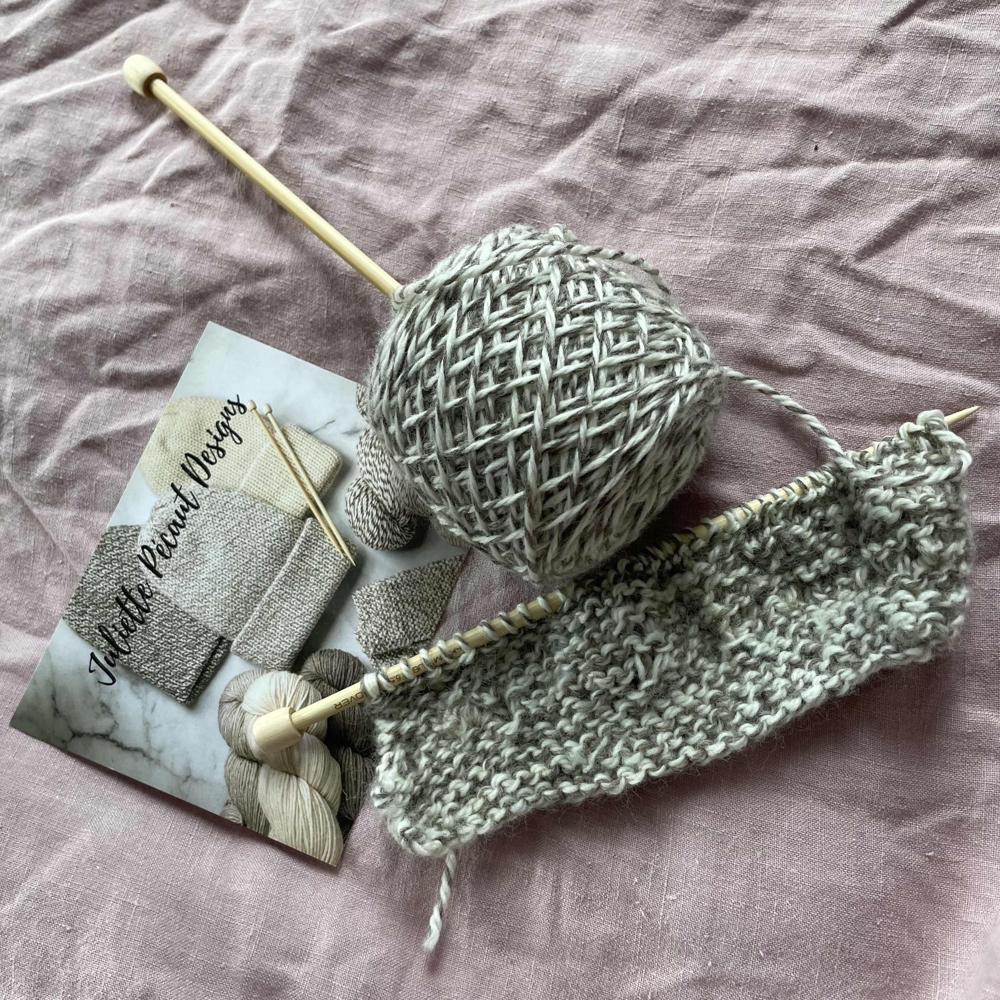

## sasha's makes

### sewing

#### helen's closet gilbert top 

- [pattern source](https://helensclosetpatterns.com/product/gilbert-top/)
- [viscose source](https://www.blackbirdfabrics.com/)

#### grainline studio archer

- [pattern source](https://grainlinestudio.com/products/archer-button-up-shirt)
- [flannel source](https://www.hawthornesupplyco.com/)
- [class source](https://workroomsocial.com/collections/sewing-classes)

#### helen's closet arden pants

- [pattern source](https://helensclosetpatterns.com/product/arden-pants/)
- [linen source](https://my.modafabrics.com/)

#### chalk + notch wren top

- [pattern source](https://www.chalkandnotch.com/shop/wren/)
- [rayon source](https://workroomsocial.com/collections/fabric)

### knitting

#### knit gloves for beginners

- [kit source](https://www.etsy.com/listing/1080219478/knitting-starter-kit-fingerless-mitts)

### crafting

#### hand woven wall hanging

- [class source](https://loopoftheloom.com/)

